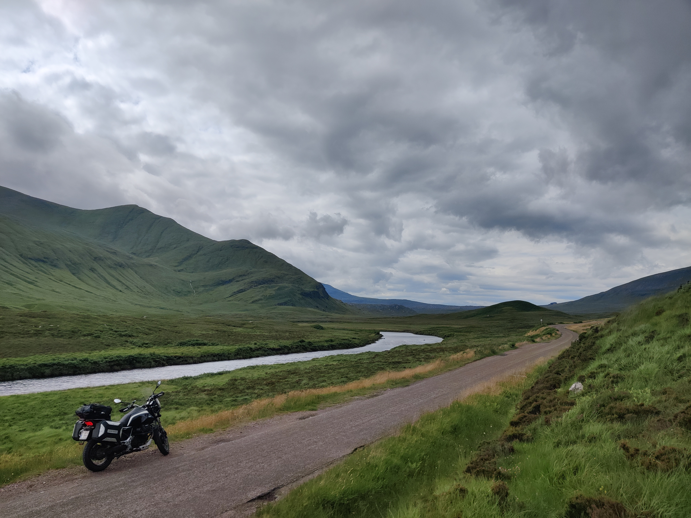

import PhotoCarousel from '../../components/PhotoCarousel.astro';

import imgIjmuiden from '@images/travel/schotland/ijmuiden.jpg';
import imgFerry from '@images/travel/schotland/ferry.jpg';
import imgNorthSea from '@images/travel/schotland/north-sea.jpg';

import imgBroraTasting from '@images/travel/schotland/brora-tasting.jpg';
import imgBroraKettles from '@images/travel/schotland/brora-kettles.jpg';
import imgBroraView from '@images/travel/schotland/brora-view.jpg';

import imgRiversideMuseum from '@images/travel/schotland/riverside-museum.jpg';
import imgRiversideMuseumInside from '@images/travel/schotland/riverside-museum-inside.jpg';
import imgGlasgow from '@images/travel/schotland/glasgow.jpg';

Test from IJmuiden to Newcastle takes sixteen hours. I left the bike on the lower deck and went up to find a bunk, and by the time I fell asleep the Dutch coast was already gone. Somewhere in the North Sea, the plan stopped feeling abstract.

<PhotoCarousel images={[
  { src: imgIjmuiden, alt: "IJmuiden" },
  { src: imgFerry, alt: "Ferry" },
  { src: imgNorthSea, alt: "North Sea" },
]} />

Three weeks. A rough loop: Glasgow, the west coast, Cape Wrath, Caithness, the Cairngorms. No fixed accommodation until Aberdeen on the last night. The Moto Guzzi V7 had fresh oil, new rear rubber, and a tank bag held together with a bungee cord I'd been meaning to replace since 2022.

Glasgow welcomed me with rain and a one-way system I ignored three times in a row. I parked near the Clyde and walked the riverside museum until closing. Motorcycles from the fifties, trams, a reconstructed Edwardian street. The kind of place that makes you feel like the present is just a temporary arrangement.

The Bealach na Bà might be the best road in Britain. That's not a controversial opinion — ask anyone who's ridden it. The gradient starts at sea level in Lochcarron and climbs in three kilometres what most Scottish passes take ten to achieve. Hairpins, blind crests, a summit that sits in the cloud even on clear days in the valleys. I went up twice. The second time I stopped near the top and watched a couple in a hire car attempt the descent in first gear, hazards blinking, knuckles presumably white.

The distilleries were the thread I'd given the trip to justify three weeks away. Brora reopened in 2021 after a forty-year closure. The building is original, the stills are original, the character is something between relief and anachronism. The guide poured a dram from the first cask and we stood in the still room while rain hit the skylights.

<PhotoCarousel images={[
  { src: imgBroraTasting, alt: "Brora distillery — the still room" },
  { src: imgBroraKettles, alt: "Wash backs, original copper" },
  { src: imgBroraView, alt: "Looking south from Brora" },
]} />

Cape Wrath is a military range and the only way in is a minibus from a ferry across the Kyle of Durness. I left the bike at the slipway and crossed with two walkers who'd been camping nearby. The lighthouse is at the end of eleven kilometres of track. The Atlantic breaks against the cliffs two hundred metres below. There's no particularly good reason to go there except that it's the corner of Britain and sometimes that's reason enough.

North of Ullapool the landscape empties out. The road becomes a suggestion. I stopped at Ardvreck Castle on Loch Assynt in late afternoon light and ate a sandwich standing next to the bike, watching the water change colour. There was nobody else there. I took a photograph and knew it wouldn't capture what the silence felt like.

<PhotoCarousel images={[
  { src: imgGlasgow, alt: "Glasgow" },
  { src: imgRiversideMuseum, alt: "Riverside Museum" },
  { src: imgRiversideMuseumInside, alt: "Riverside Museum Inside" },
]} />

The ride home was faster than the ride out. I caught the evening ferry from Newcastle with an hour to spare and found the same bunk, more or less. The North Sea in August is grey and flat and you can stand on the deck without holding anything. I tried to write up some notes and gave up after two paragraphs. The pictures would have to do.
